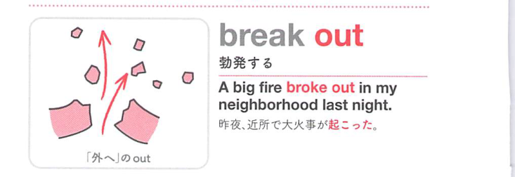
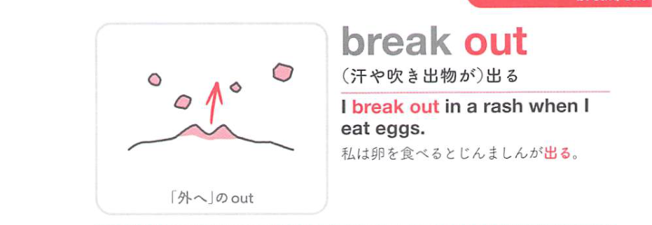

### 連想

break out は「内側から外へ破れて出る」イメージ。火事や戦争、汗などが急に出る ⇒ 起こる、出る、急にしだす。

### 類義語
- break out
  - 火事・戦争・病気などが突然発生する
  - 急に外へ出る感じ
- occur
  - 「起こる」
  - 中立的
- erupt
  - 「噴出する、勃発する」
  - 急激さが強い

### 画像
<!-- 熟語に対応する画像 -->

<!-- 動詞に対応する画像 -->

<!-- 前置詞に対応する画像 -->

