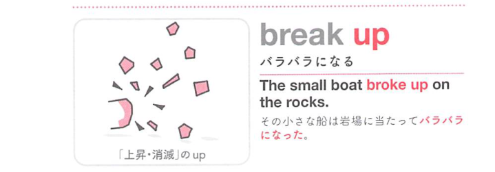
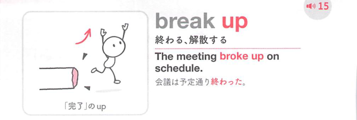

### 連想

break up は「まとまりが壊れてばらばらになる」イメージ。集団・関係・物を解体する、別れる、終わる、という意味になる。

### 類義語
- break up
  - 解散する、ばらばらにする、別れる
  - まとまりの崩壊が共通
- split up
  - 「別れる、分かれる」
  - 人間関係や集団に使う
- dissolve
  - 「解散する、溶ける」
  - 硬め

### 画像
<!-- 熟語に対応する画像 -->

<!-- 動詞に対応する画像 -->

<!-- 前置詞に対応する画像 -->

