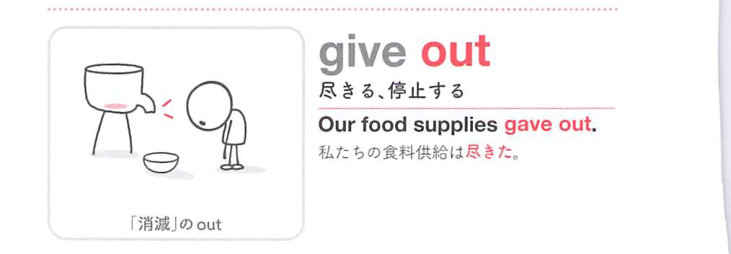
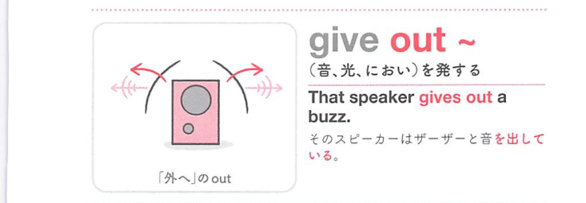
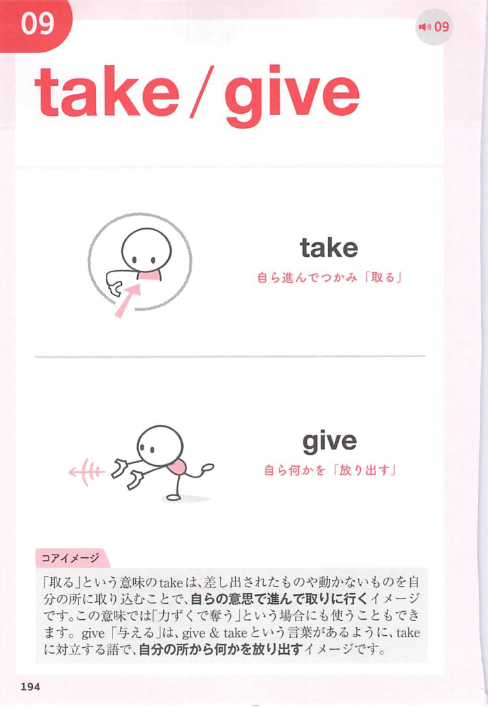
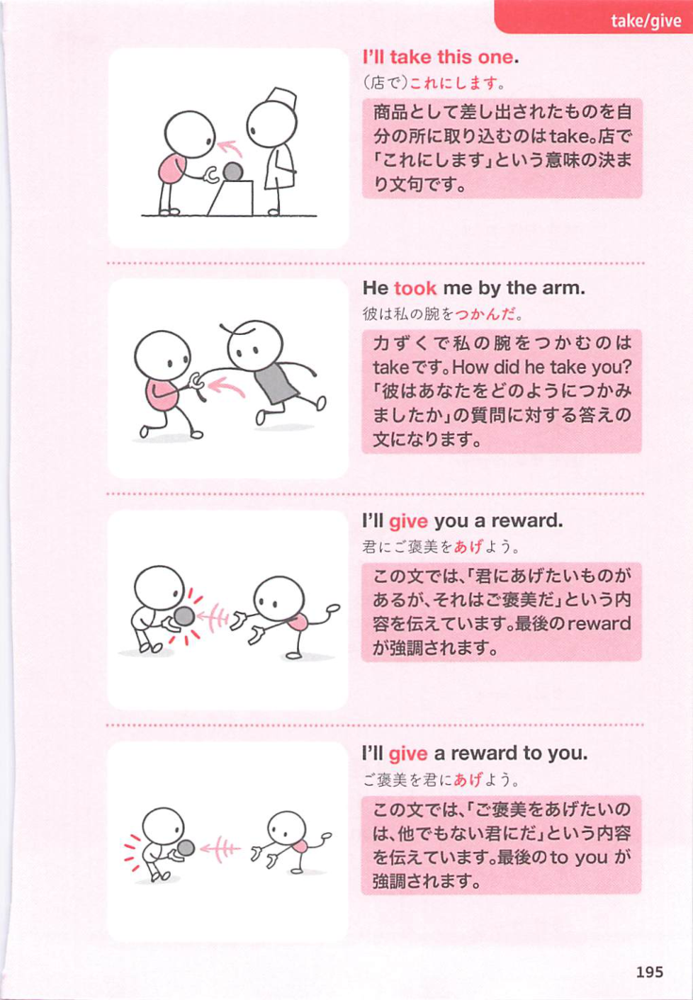
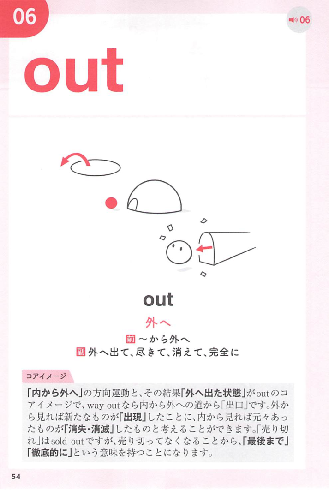
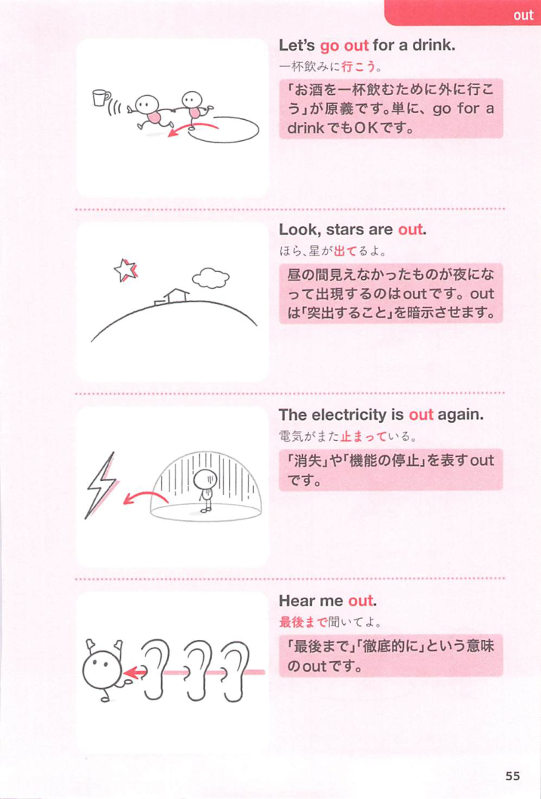

### 連想

give out は「外へ与え出す」イメージ。配る、光や音を発する。蓄えが外へ出尽くすと「尽きる」になる。

### 類義語
- give out
  - 配る、発する、尽きる
  - 外へ出る感覚が共通
- distribute
  - 「配布する」
  - 硬い表現
- give off
  - 光・においなどを発する

### 画像
<!-- 熟語に対応する画像 -->

<!-- 動詞に対応する画像 -->

<!-- 前置詞に対応する画像 -->

