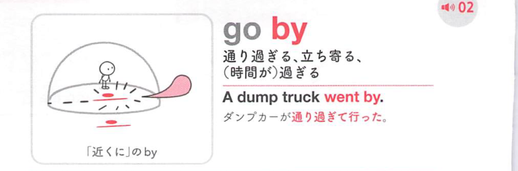

### 連想

go by は「そばを通って過ぎる」イメージ。時間が過ぎる、通り過ぎる、ある名前で通る、基準に従う、へ広がる。

### 類義語
- go by
  - 時がたつ、通り過ぎる、名で知られる、基準に従う
  - by は「そばを通る」感覚
- pass
  - 「過ぎる」
  - 時間や場所に使う
- follow
  - 「従う」
  - 基準に従う意味に近い

### 画像
<!-- 熟語に対応する画像 -->

<!-- 動詞に対応する画像 -->

<!-- 前置詞に対応する画像 -->

