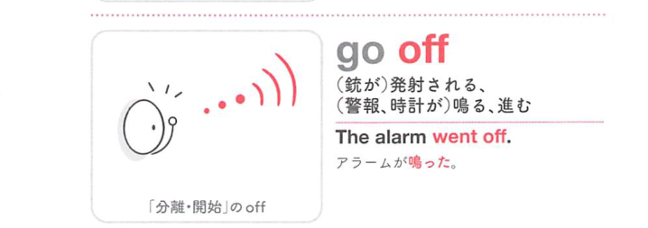
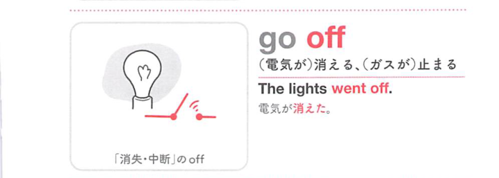

### 連想

go off は「離れて作動・消失する」イメージ。出かける、明かりが消える、装置が作動する、爆発・発射する、へ広がる。

### 類義語
- go off
  - 去る、消える、作動する、爆発する
  - off の「離れる・切れる」が中心
- explode
  - 「爆発する」
  - 爆薬の意味に近い
- go out
  - 出かける、明かりが消える

### 画像
<!-- 熟語に対応する画像 -->

<!-- 動詞に対応する画像 -->

<!-- 前置詞に対応する画像 -->

