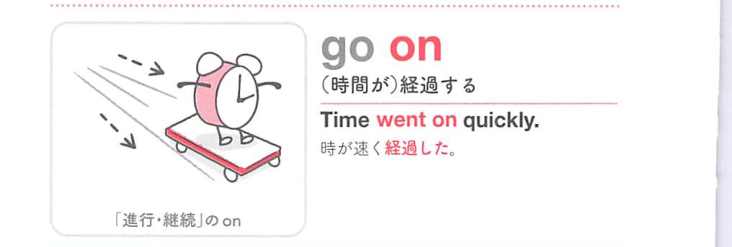
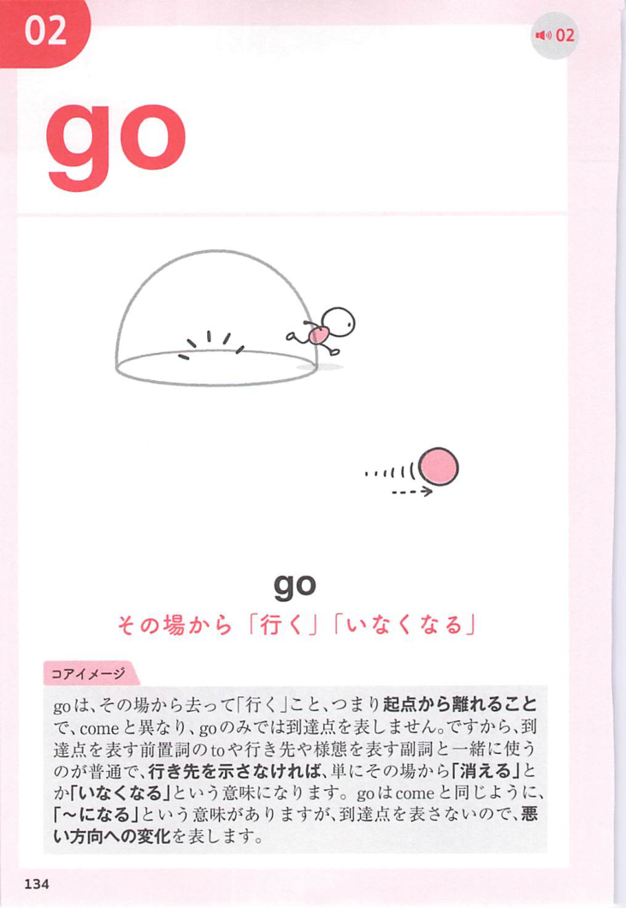
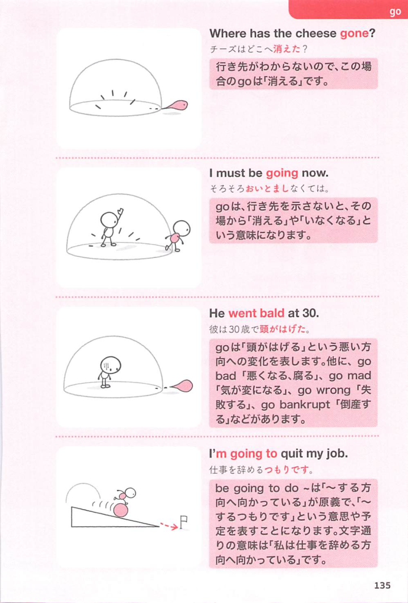
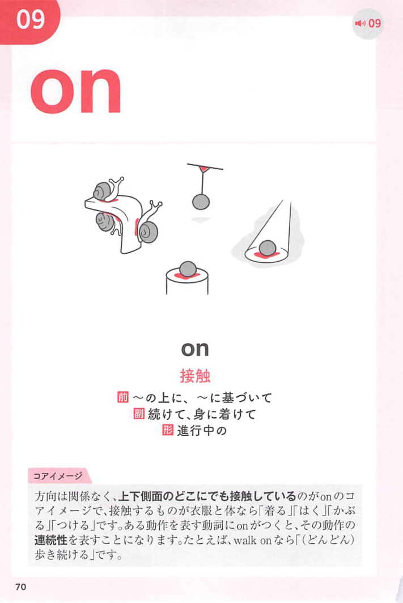
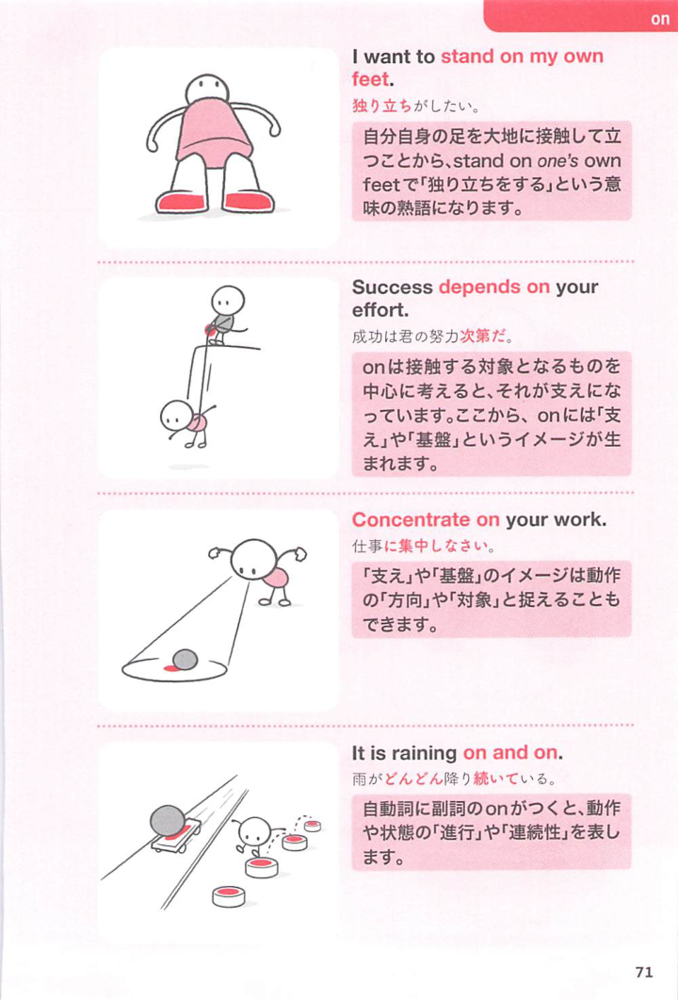

### 連想

go on は「先へ進み続ける」イメージ。状況や時間が続く、出来事が起こる、旅行などに出かける、という意味になる。

### 類義語
- go on
  - 続く、起こる、出かける
  - 進行の感覚が中心
- continue
  - 「続く、続ける」
  - 中立的
- happen
  - 「起こる」
  - be going on の意味に近い

### 画像
<!-- 熟語に対応する画像 -->

<!-- 動詞に対応する画像 -->

<!-- 前置詞に対応する画像 -->

