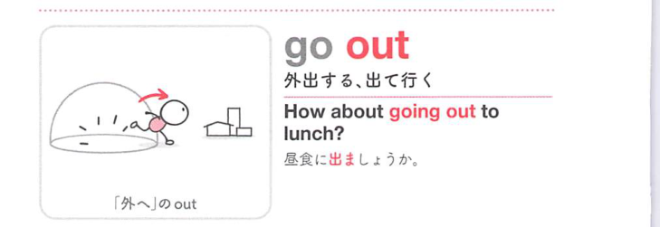

### 連想

go out は「外へ行く」イメージ。外出する、火や明かりが外れて消える、意識や命が消える、へ広がる。

### 類義語
- go out
  - 出かける、明かりが消える、気絶する、死ぬ
  - out の「外へ・消える」が中心
- leave
  - 「出る、去る」
  - 外出の意味に近い
- go off
  - 出かける、消える、作動する

### 画像
<!-- 熟語に対応する画像 -->

<!-- 動詞に対応する画像 -->

<!-- 前置詞に対応する画像 -->

