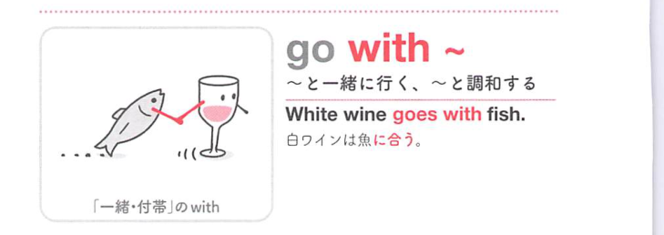

### 連想

go with ~ は「〜と一緒に行く」イメージ。人と付き合う、一緒に行く、物が組み合わさって似合う、へ広がる。

### 類義語
- go with
  - 一緒に行く、付き合う、似合う
  - 組み合わせの感覚がある
- accompany
  - 「同行する」
  - 硬い表現
- match
  - 「合う、似合う」
  - 色や服に使いやすい

### 画像
<!-- 熟語に対応する画像 -->

<!-- 動詞に対応する画像 -->

<!-- 前置詞に対応する画像 -->

