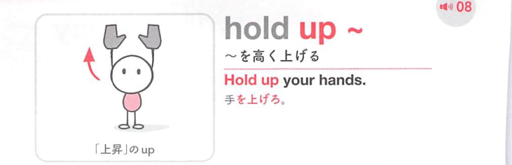
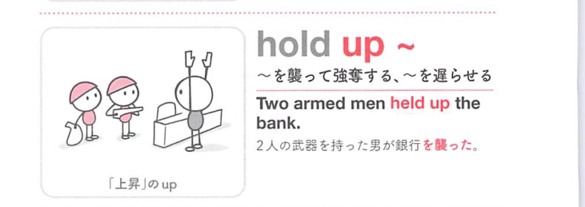

### 連想

hold up は「上に持って支える」イメージ。持ち上げる、支える、持ちこたえる。進行を上で止めると「遅らせる」、強盗の意味にもなる。

### 類義語
- hold up
  - 持ち上げる、支える、遅らせる、強盗に入る
  - 上で止める感覚が中心
- support
  - 「支える」
  - 支持の意味に近い
- delay
  - 「遅らせる」
  - 進行を止める意味に近い

### 画像
<!-- 熟語に対応する画像 -->

<!-- 動詞に対応する画像 -->

<!-- 前置詞に対応する画像 -->

