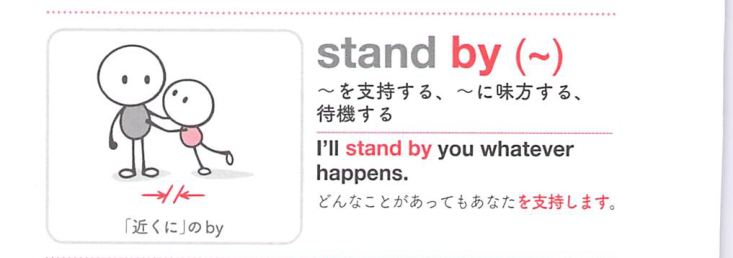

### 連想

stand by は「そばに立つ」イメージ。何もせず傍観する、待機する、また相手のそばに立って支持する ⇒ 傍観する、支持する。

### 類義語
- stand by
  - 傍観する、待機する、支持する、約束を守る
  - そばにいる感覚が中心
- support
  - 「支持する」
  - 支える意味に近い
- stand up for
  - 「擁護する」
  - 積極的に守る

### 画像
<!-- 熟語に対応する画像 -->

<!-- 動詞に対応する画像 -->

<!-- 前置詞に対応する画像 -->

