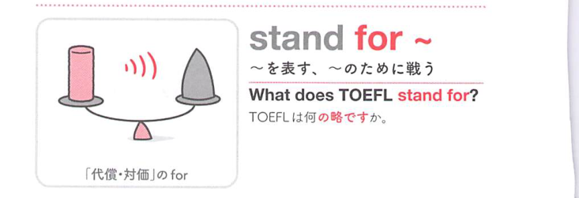

### 連想

stand for ~ は「〜を表すものとして立つ」イメージ。略語が意味を代表する。また否定文では我慢して立っていられない ⇒ 許容する。

### 類義語
- stand for
  - 意味する、略である、許容する
  - represent の意味が基本
- represent
  - 「表す、代表する」
  - 意味の用法に近い
- tolerate
  - 「我慢する、許容する」
  - 否定文の用法に近い

### 画像
<!-- 熟語に対応する画像 -->

<!-- 動詞に対応する画像 -->

<!-- 前置詞に対応する画像 -->

