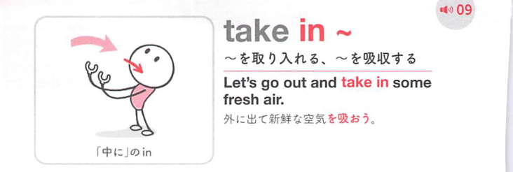
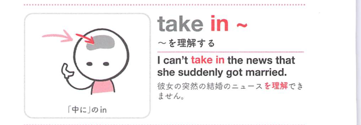
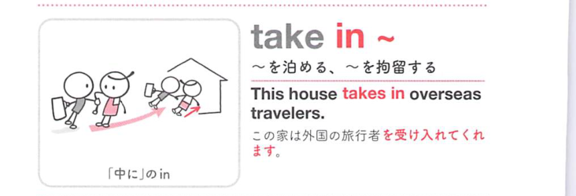
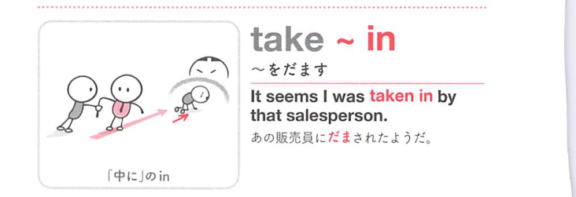
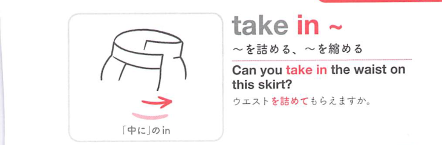

### 連想

take in ~ は「内側に取り込む」イメージ。情報を理解する、人をだます、見物する、含む、へ広がる。

### 類義語
- take in
  - 取り入れる、理解する、だます、見物する
  - 内へ入れる感覚が中心
- include
  - 「含む」
  - 取り入れる意味に近い
- understand
  - 「理解する」
  - 頭に取り込む意味

### 画像
<!-- 熟語に対応する画像 -->

<!-- 動詞に対応する画像 -->

<!-- 前置詞に対応する画像 -->

