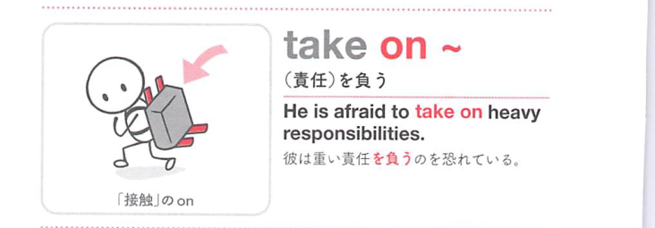
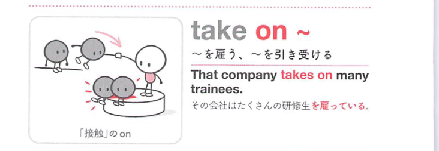

### 連想

take on ~ は「自分の上に引き受けて載せる」イメージ。仕事や責任を引き受ける、人を雇う、性質を帯びる、へ広がる。

### 類義語
- take on
  - 引き受ける、雇う、性質を帯びる
  - 自分に取り込む感じ
- undertake
  - 「引き受ける」
  - 硬い表現
- employ
  - 「雇う」
  - 人を雇う意味に近い

### 画像
<!-- 熟語に対応する画像 -->

<!-- 動詞に対応する画像 -->

<!-- 前置詞に対応する画像 -->

