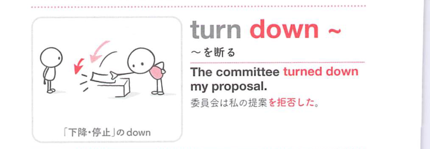
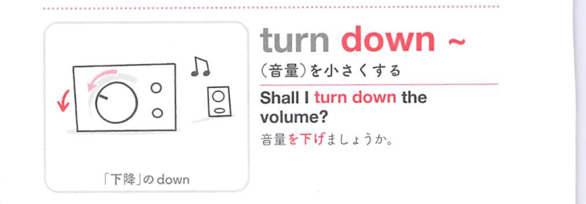

### 連想

turn down ~ は、turn は「向きを変える」なので、状態や方向が変わるイメージです。特に down は「下へ下がる、勢いを弱める、記録する」方向を添えるので、熟語全体の意味につながります
このイメージから、`〜を却下[拒絶]する；(音量・火力など)を小さくする` という意味につながる。
複数の意味がある場合も、中心になる動きや状態を押さえておくと、文脈ごとの意味を選びやすい。
補足として、①②ともに turn ~ down の語順も可 という点も一緒に覚えておくとよい。

### 類義語
- turn down ~
  - 対象の意味は「〜を却下[拒絶]する；(音量・火力など)を小さくする」。この熟語特有の語順・前置詞まで含めて覚える
- reject
  - 1語で言える近い表現。文脈によって置き換えやすい
- refuse
  - 1語で言える近い表現。文脈によって置き換えやすい

### 画像
<!-- 熟語に対応する画像 -->

<!-- 動詞に対応する画像 -->

<!-- 前置詞に対応する画像 -->

