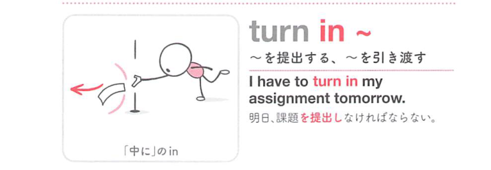
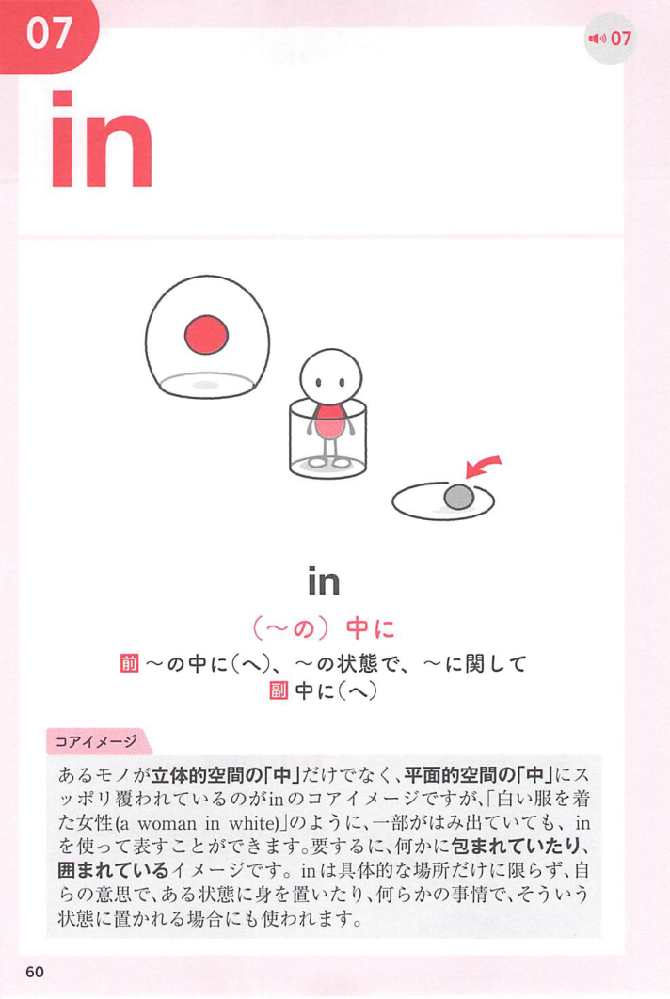
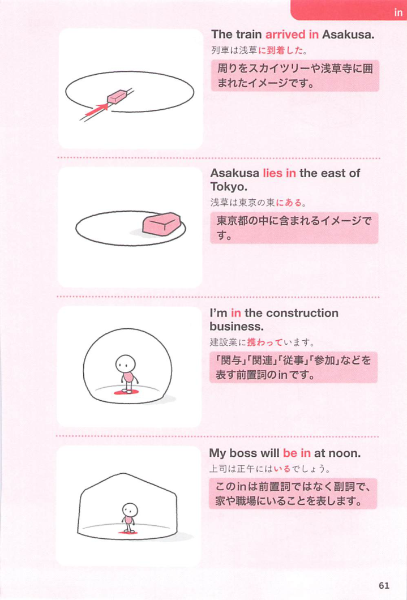

### 連想

turn in ~ は、turn は「向きを変える」なので、状態や方向が変わるイメージです。特に in は「中へ入る、内側に取り込む」方向を添えるので、熟語全体の意味につながります
このイメージから、`〜を提出する；〜を引き渡す；〜を返却する` という意味につながる。
複数の意味がある場合も、中心になる動きや状態を押さえておくと、文脈ごとの意味を選びやすい。
補足として、①②ともに turn ~ in の語順も可 という点も一緒に覚えておくとよい。

### 類義語
- turn in ~
  - 対象の意味は「〜を提出する；〜を引き渡す；〜を返却する」。この熟語特有の語順・前置詞まで含めて覚える
- submit
  - 1語で言える近い表現。文脈によって置き換えやすい
- hand in ~
  - 意味は近いが、後ろに続く語や文型が異なることがある
- give in ~
  - 意味は近いが、後ろに続く語や文型が異なることがある
- hand over ~
  - 意味は近いが、後ろに続く語や文型が異なることがある

### 画像
<!-- 熟語に対応する画像 -->

<!-- 動詞に対応する画像 -->

<!-- 前置詞に対応する画像 -->

