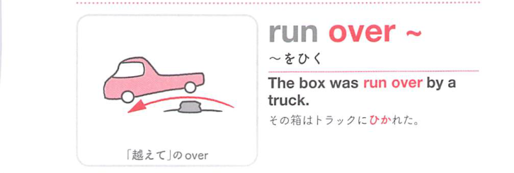
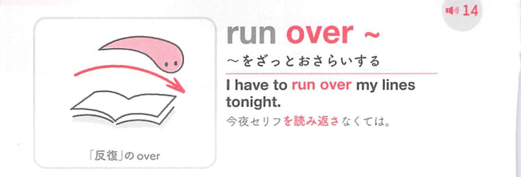

### 連想

run over (~) は、over の「上を越える、全体を見渡す、相手側へ移す」という感覚を手がかりに、語句全体を1つの場面として捉えると覚えやすい表現です
このイメージから、`(車が)〜をひく；(〜から)あふれる` という意味につながる。
複数の意味がある場合も、中心になる動きや状態を押さえておくと、文脈ごとの意味を選びやすい。
補足として、run ~ over の語順も可 という点も一緒に覚えておくとよい。

### 類義語
- run over (~)
  - 対象の意味は「(車が)〜をひく；(〜から)あふれる」。この熟語特有の語順・前置詞まで含めて覚える
- overflow
  - 1語で言える近い表現。文脈によって置き換えやすい

### 画像
<!-- 熟語に対応する画像 -->

<!-- 動詞に対応する画像 -->

<!-- 前置詞に対応する画像 -->

