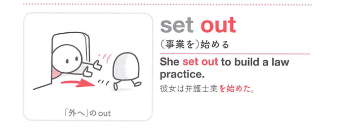
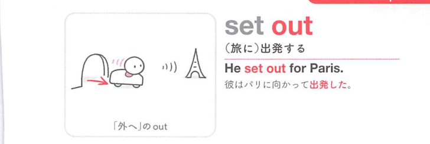
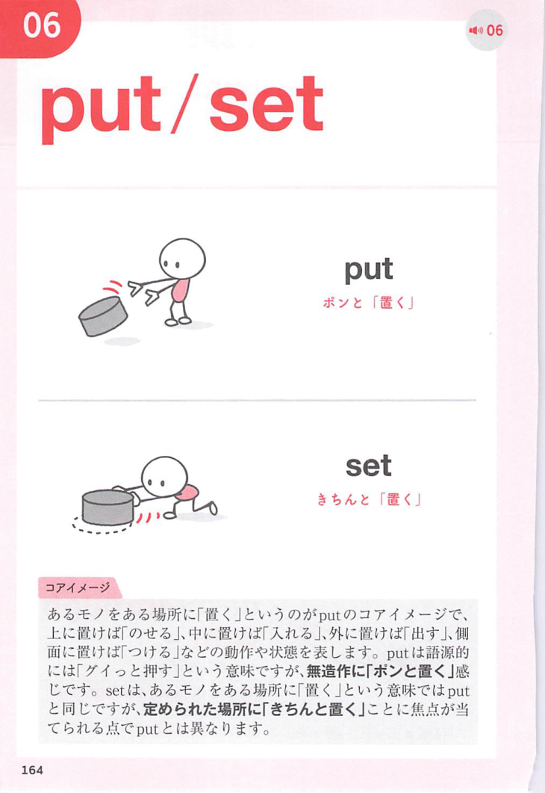
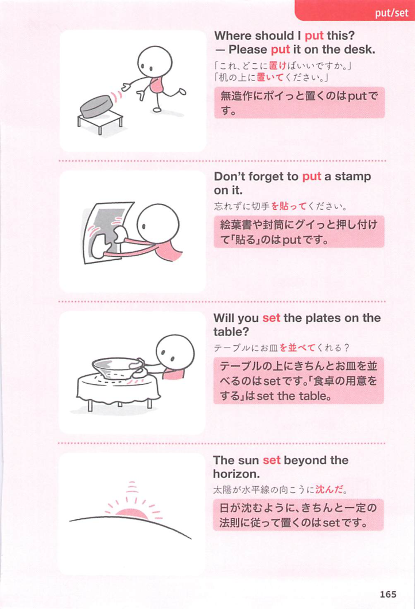

### 連想

set out (~) は、set は「定めて置く」なので、位置・状態・計画を固定するイメージです。特に out は「外へ出る、はっきり現れる、最後までやり切る」方向を添えるので、熟語全体の意味につながります
このイメージから、`出発する；(set out to do で)…し始める；〜を並べる；〜を設計する` という意味につながる。
複数の意味がある場合も、中心になる動きや状態を押さえておくと、文脈ごとの意味を選びやすい。
補足として、set off → 474 という点も一緒に覚えておくとよい。

### 類義語
- set out (~)
  - 対象の意味は「出発する；(set out to do で)…し始める；〜を並べる；〜を設計する」。この熟語特有の語順・前置詞まで含めて覚える
- set off
  - 近い意味を表す表現。細かな文型や響きの違いに注意する
- start
  - 1語で言える近い表現。文脈によって置き換えやすい
- begin
  - 1語で言える近い表現。文脈によって置き換えやすい
- lay out ~
  - 意味は近いが、後ろに続く語や文型が異なることがある

### 画像
<!-- 熟語に対応する画像 -->

<!-- 動詞に対応する画像 -->

<!-- 前置詞に対応する画像 -->

