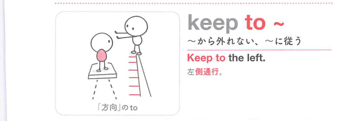
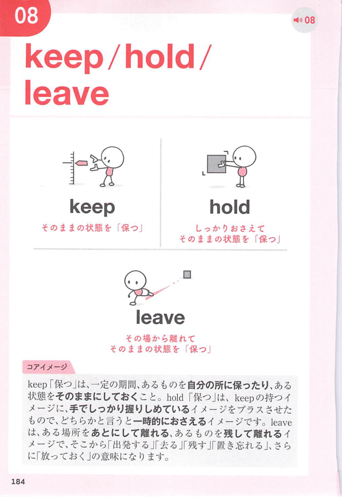
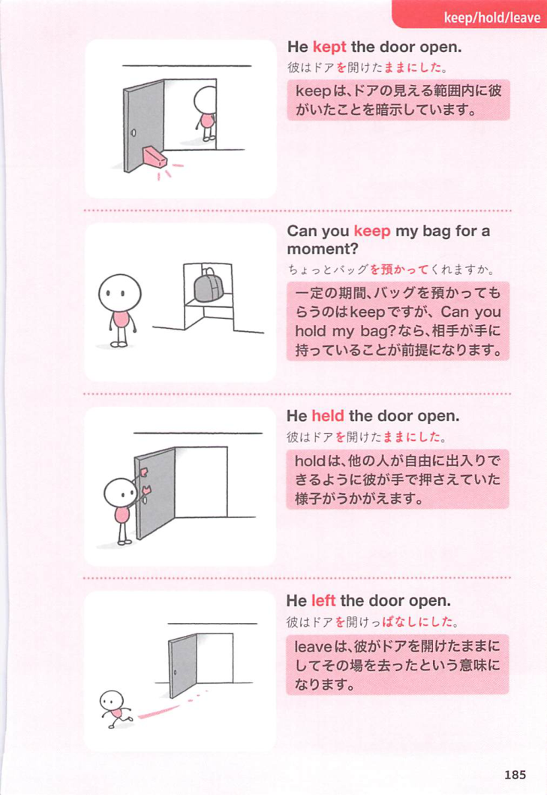

### 連想

keep to ~ は、keep は「保つ」なので、状態を維持するイメージです。特に to は「方向・到達点・相手に向かう」方向を添えるので、熟語全体の意味につながります
このイメージから、`〜に沿って進む；〜から離れない；〜に従う` という意味につながる。
補足として、keep to oneself は『(人を避けて)1人でいる』 という点も一緒に覚えておくとよい。

### 類義語
- keep to ~
  - 対象の意味は「〜に沿って進む；〜から離れない；〜に従う」。この熟語特有の語順・前置詞まで含めて覚える
- obey
  - 1語で言える近い表現。文脈によって置き換えやすい

### 画像
<!-- 熟語に対応する画像 -->

<!-- 動詞に対応する画像 -->

<!-- 前置詞に対応する画像 -->

