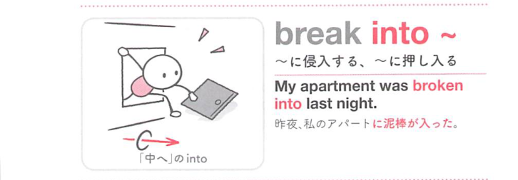

### 連想

break into ~ は、break は「壊れる・破る」なので、まとまりや静けさが破れるイメージです。特に into は「中へ入り、別の状態へ変わる」方向を添えるので、熟語全体の意味につながります
このイメージから、`〜に侵入する；急に〜をしだす` という意味につながる。
複数の意味がある場合も、中心になる動きや状態を押さえておくと、文脈ごとの意味を選びやすい。
補足として、自動詞として『侵入する』は、break in → 376① という点も一緒に覚えておくとよい。

### 類義語
- break into ~
  - 対象の意味は「〜に侵入する；急に〜をしだす」。この熟語特有の語順・前置詞まで含めて覚える
- burst into ~
  - 意味は近いが、後ろに続く語や文型が異なることがある

### 画像
<!-- 熟語に対応する画像 -->

<!-- 動詞に対応する画像 -->

<!-- 前置詞に対応する画像 -->

