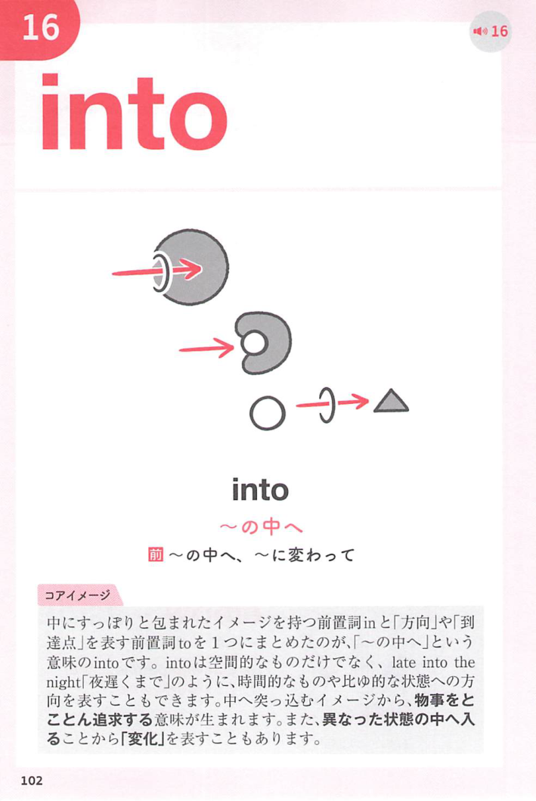
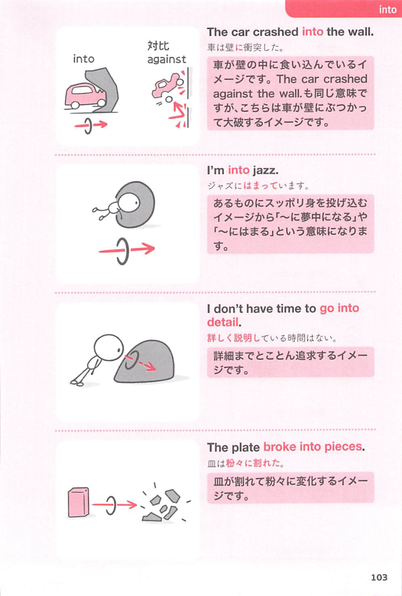

### 連想

burst into ~ は、into の「中へ入り、別の状態へ変わる」という感覚を手がかりに、語句全体を1つの場面として捉えると覚えやすい表現です
このイメージから、`急に〜をしだす；突然〜に入る` という意味につながる。
補足として、break into ~ → 435② という点も一緒に覚えておくとよい。

### 類義語
- burst into ~
  - 対象の意味は「急に〜をしだす；突然〜に入る」。この熟語特有の語順・前置詞まで含めて覚える
- break into ~
  - 意味は近いが、後ろに続く語や文型が異なることがある

### 画像
<!-- 熟語に対応する画像 -->

<!-- 前置詞に対応する画像 -->

