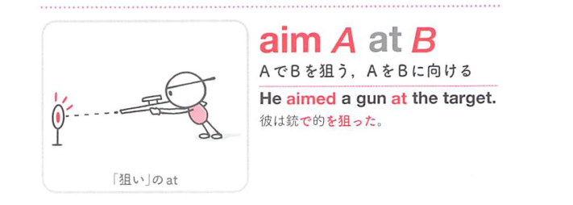
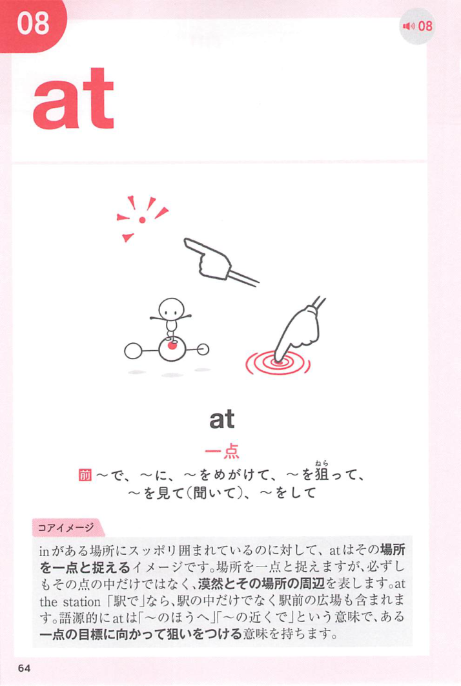
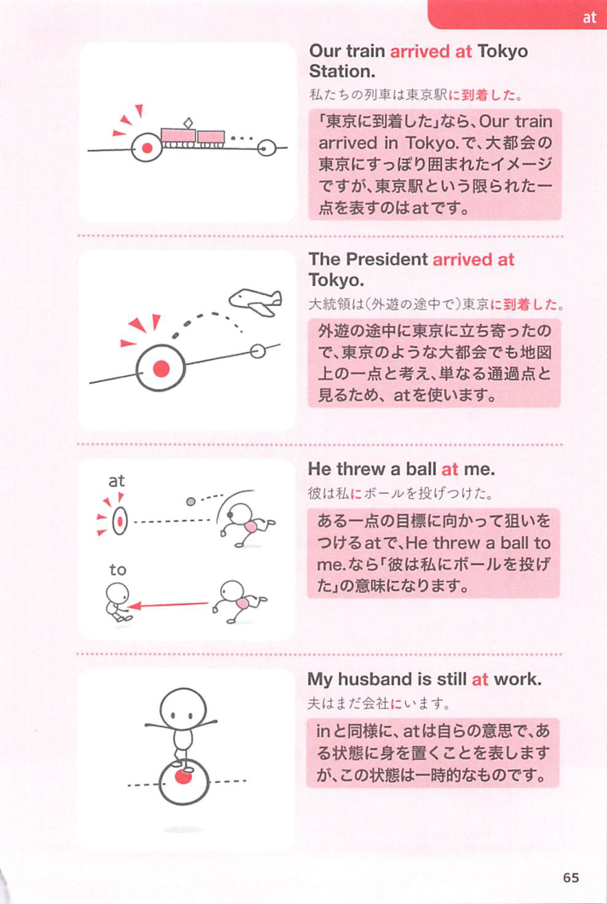

### 連想

aim at ~ は、at の「一点・状態・対象を指す」という感覚を手がかりに、語句全体を1つの場面として捉えると覚えやすい表現です
このイメージから、`〜を目指す；〜を狙う` という意味につながる。
補足として、『A を B に向ける』は、aim A at B。この場合の aim は他動詞 という点も一緒に覚えておくとよい。

### 類義語
- aim at ~
  - 対象の意味は「〜を目指す；〜を狙う」。この熟語特有の語順・前置詞まで含めて覚える
- より直接的な基本表現
  - 日本語訳に近い意味を1語や短い表現で言い換える場合に使う。試験では熟語の形そのものを優先して覚える
- 文脈に応じた言い換え
  - 同じ日本語訳でも、対象・文体・前後関係によって自然な英語表現が変わる

### 画像
<!-- 熟語に対応する画像 -->

<!-- 前置詞に対応する画像 -->

