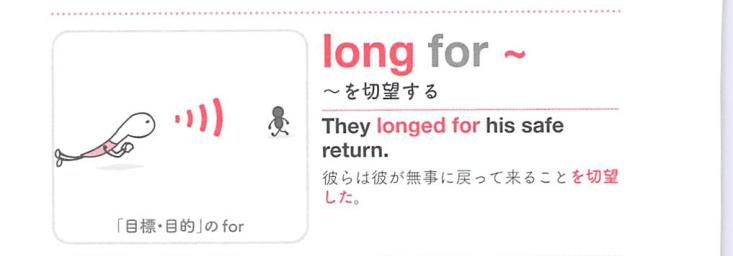

### 連想

long for ~ は、for の「目的・理由・代わり・対象に向かう」という感覚を手がかりに、語句全体を1つの場面として捉えると覚えやすい表現です
このイメージから、`〜を切望する` という意味につながる。
補足として、yearn for ~ → 849 という点も一緒に覚えておくとよい。

### 類義語
- long for ~
  - 対象の意味は「〜を切望する」。この熟語特有の語順・前置詞まで含めて覚える
- yearn for ~
  - 意味は近いが、後ろに続く語や文型が異なることがある
- wish for ~
  - 意味は近いが、後ろに続く語や文型が異なることがある

### 画像
<!-- 熟語に対応する画像 -->

<!-- 前置詞に対応する画像 -->

