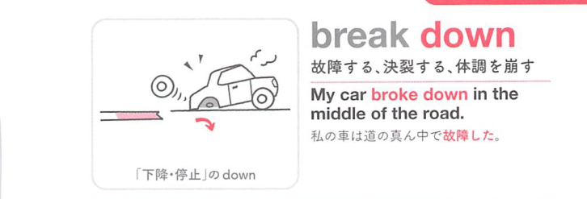
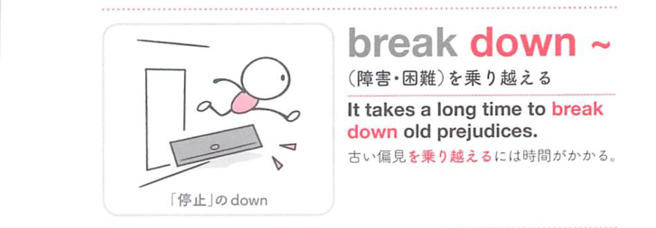
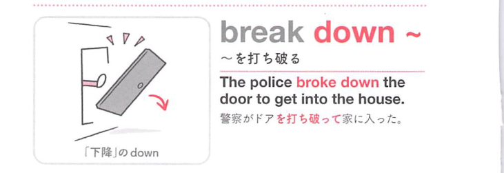

### 連想

break down (~) は、break は「壊れる・破る」なので、まとまりや静けさが破れるイメージです。特に down は「下へ下がる、勢いを弱める、記録する」方向を添えるので、熟語全体の意味につながります
このイメージから、`〜を分解する；〜を壊す；故障する；取り乱す；肉体的[精神的]に参る` という意味につながる。
複数の意味がある場合も、中心になる動きや状態を押さえておくと、文脈ごとの意味を選びやすい。
補足として、break ~ down の語順も可 という点も一緒に覚えておくとよい。

### 類義語
- break down (~)
  - 対象の意味は「〜を分解する；〜を壊す；故障する；取り乱す；肉体的[精神的]に参る」。この熟語特有の語順・前置詞まで含めて覚える
- より直接的な基本表現
  - 日本語訳に近い意味を1語や短い表現で言い換える場合に使う。試験では熟語の形そのものを優先して覚える
- 文脈に応じた言い換え
  - 同じ日本語訳でも、対象・文体・前後関係によって自然な英語表現が変わる

### 画像
<!-- 熟語に対応する画像 -->

<!-- 動詞に対応する画像 -->

<!-- 前置詞に対応する画像 -->

