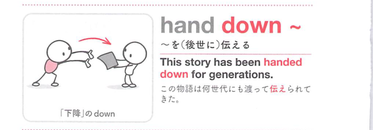
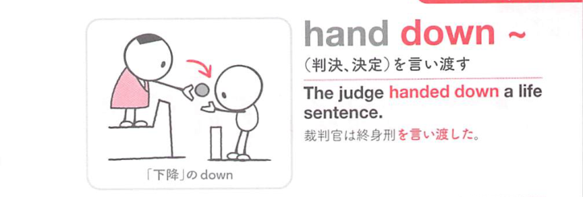

### 連想

hand down ~ は、down の「下へ下がる、勢いを弱める、記録する」という感覚を手がかりに、語句全体を1つの場面として捉えると覚えやすい表現です
このイメージから、`〜を(子孫[後世]に)伝える` という意味につながる。
補足として、hand ~ down の語順も可 という点も一緒に覚えておくとよい。

### 類義語
- hand down ~
  - 対象の意味は「〜を(子孫[後世]に)伝える」。この熟語特有の語順・前置詞まで含めて覚える
- pass down ~
  - 意味は近いが、後ろに続く語や文型が異なることがある
- pass on ~
  - 意味は近いが、後ろに続く語や文型が異なることがある

### 画像
<!-- 熟語に対応する画像 -->

<!-- 動詞に対応する画像 -->

<!-- 前置詞に対応する画像 -->

