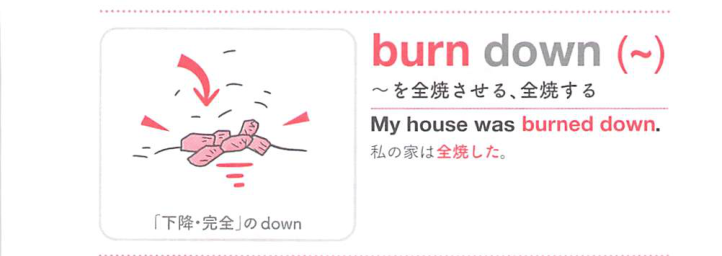
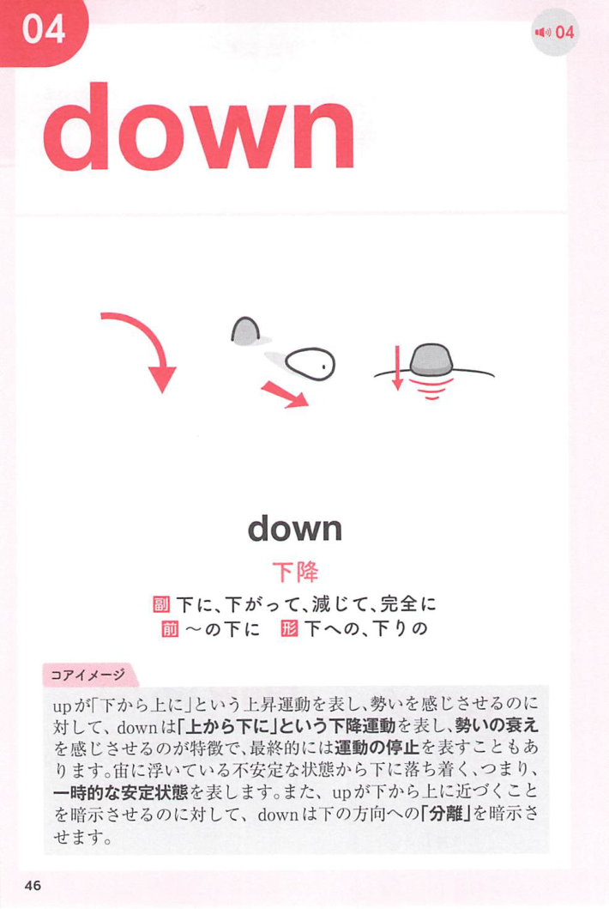
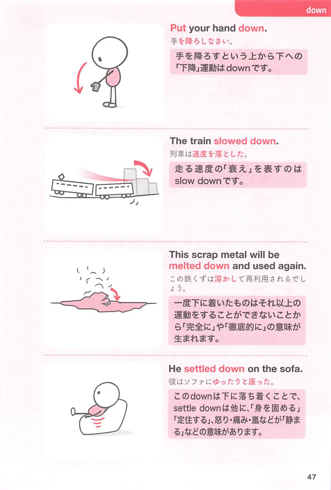

### 連想

burn down (~) は、down の「下へ下がる、勢いを弱める、記録する」という感覚を手がかりに、語句全体を1つの場面として捉えると覚えやすい表現です
このイメージから、`〜を全焼させる；(建物が)全焼する` という意味につながる。
補足として、他動詞では burn ~ down の語順も可 という点も一緒に覚えておくとよい。

### 類義語
- burn down (~)
  - 対象の意味は「〜を全焼させる；(建物が)全焼する」。この熟語特有の語順・前置詞まで含めて覚える
- burn (~) to the ground
  - 意味は近いが、後ろに続く語や文型が異なることがある
- reduce ~ to ashes
  - 意味は近いが、後ろに続く語や文型が異なることがある

### 画像
<!-- 熟語に対応する画像 -->

<!-- 前置詞に対応する画像 -->

