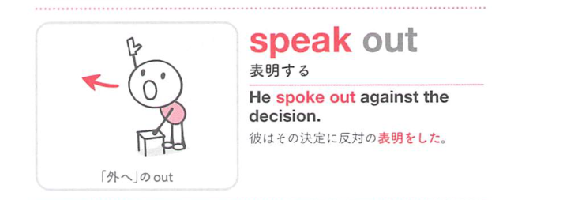

### 連想

speak out は、out の「外へ出る、はっきり現れる、最後までやり切る」という感覚を手がかりに、語句全体を1つの場面として捉えると覚えやすい表現です
このイメージから、`はっきり[思い切って]話す` という意味につながる。
補足として、『聞こえるように』大きな声で言うの意味にもなる という点も一緒に覚えておくとよい。

### 類義語
- speak out
  - 対象の意味は「はっきり[思い切って]話す」。この熟語特有の語順・前置詞まで含めて覚える
- speak up
  - 同じ項目で扱われる別形。意味は近いが、使える形をまとめて覚える
- より直接的な基本表現
  - 日本語訳に近い意味を1語や短い表現で言い換える場合に使う。試験では熟語の形そのものを優先して覚える
- 文脈に応じた言い換え
  - 同じ日本語訳でも、対象・文体・前後関係によって自然な英語表現が変わる

### 画像
<!-- 熟語に対応する画像 -->

<!-- 前置詞に対応する画像 -->

