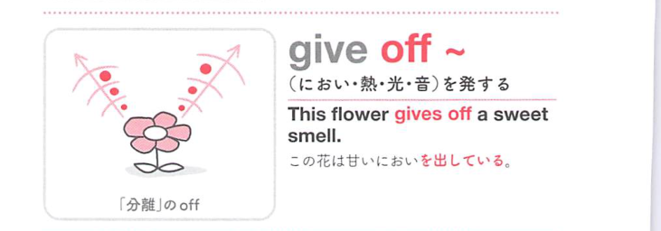
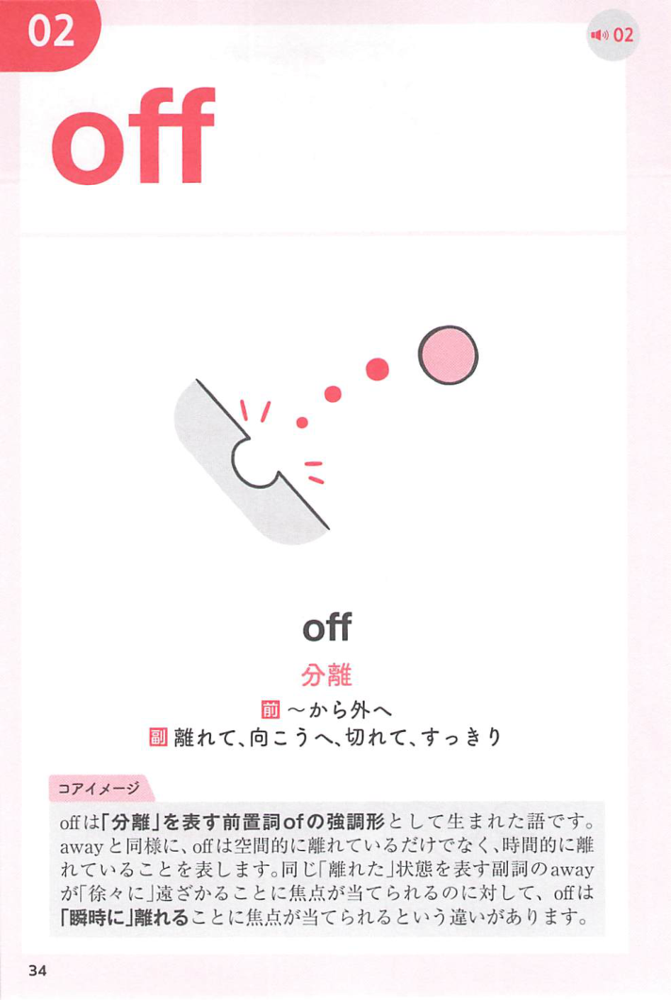
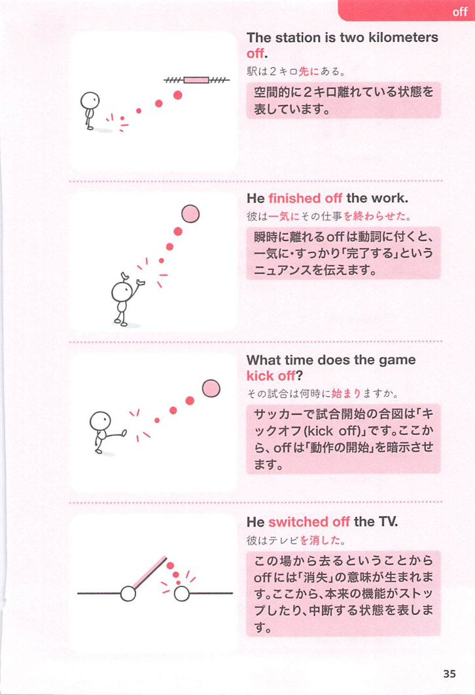

### 連想

give off ~ は、give は「与える・外へ出す」なので、物や状態を外に渡すイメージです。特に off は「離れる、切り離す、停止する」方向を添えるので、熟語全体の意味につながります
このイメージから、`(光・音・においなど)を発する` という意味につながる。
補足として、give out ~ → 383① という点も一緒に覚えておくとよい。

### 類義語
- give off ~
  - 対象の意味は「(光・音・においなど)を発する」。この熟語特有の語順・前置詞まで含めて覚える
- give out ~
  - 意味は近いが、後ろに続く語や文型が異なることがある
- produce
  - 1語で言える近い表現。文脈によって置き換えやすい
- emit
  - 1語で言える近い表現。文脈によって置き換えやすい

### 画像
<!-- 熟語に対応する画像 -->

<!-- 動詞に対応する画像 -->

<!-- 前置詞に対応する画像 -->

