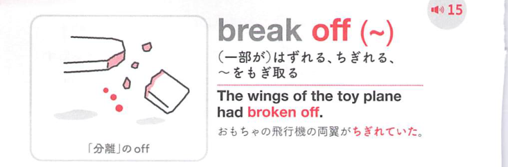
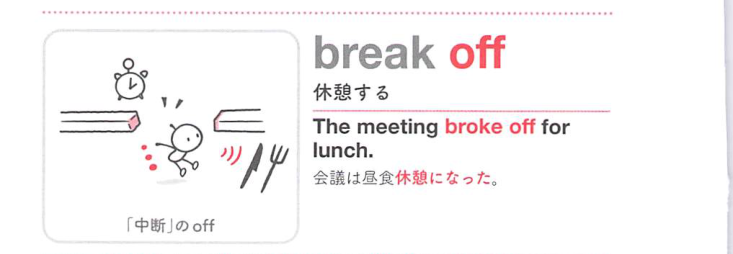
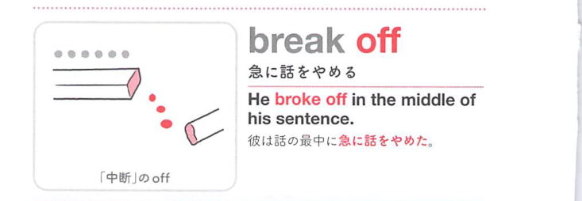
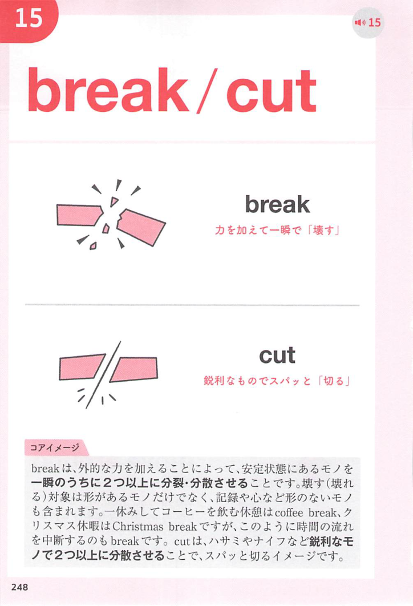
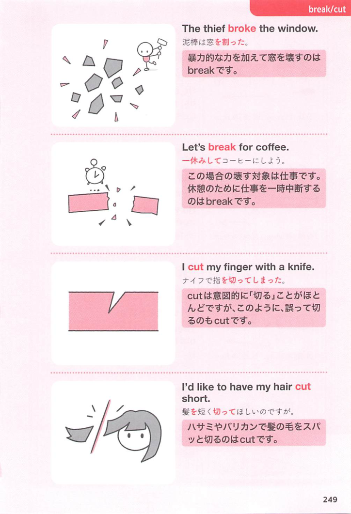

### 連想

break off (~) は、break は「壊れる・破る」なので、まとまりや静けさが破れるイメージです。特に off は「離れる、切り離す、停止する」方向を添えるので、熟語全体の意味につながります
このイメージから、`(〜を)急にやめる；〜を切り離す` という意味につながる。
補足として、他動詞では break ~ off の語順も可 という点も一緒に覚えておくとよい。

### 類義語
- break off (~)
  - 対象の意味は「(〜を)急にやめる；〜を切り離す」。この熟語特有の語順・前置詞まで含めて覚える
- より直接的な基本表現
  - 日本語訳に近い意味を1語や短い表現で言い換える場合に使う。試験では熟語の形そのものを優先して覚える
- 文脈に応じた言い換え
  - 同じ日本語訳でも、対象・文体・前後関係によって自然な英語表現が変わる

### 画像
<!-- 熟語に対応する画像 -->

<!-- 動詞に対応する画像 -->

<!-- 前置詞に対応する画像 -->

