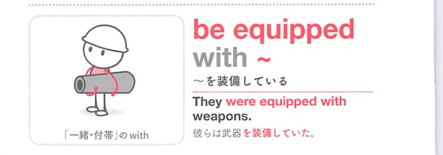

### 連想

be equipped with ~ は、be は「そういう状態にある」と考えると、後ろの語が状態や関係を説明します。特に with は「一緒に、関わって、相手に対して」方向を添えるので、熟語全体の意味につながります
このイメージから、`〜を備えている` という意味につながる。
補足として、『教育・才能』などの抽象的なものを『備えている』場合にも使える。(= be blessed with ~, be gifted with ~『〜に恵まれている』) という点も一緒に覚えておくとよい。

### 類義語
- be equipped with ~
  - 対象の意味は「〜を備えている」。この熟語特有の語順・前置詞まで含めて覚える
- より直接的な基本表現
  - 日本語訳に近い意味を1語や短い表現で言い換える場合に使う。試験では熟語の形そのものを優先して覚える
- 文脈に応じた言い換え
  - 同じ日本語訳でも、対象・文体・前後関係によって自然な英語表現が変わる

### 画像
<!-- 熟語に対応する画像 -->

<!-- 前置詞に対応する画像 -->

