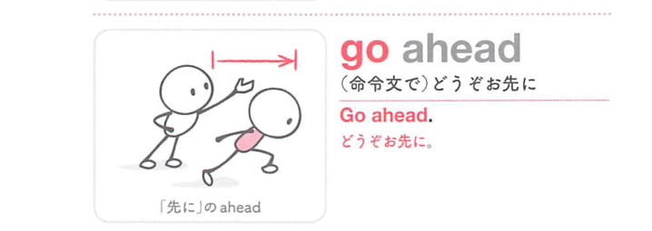
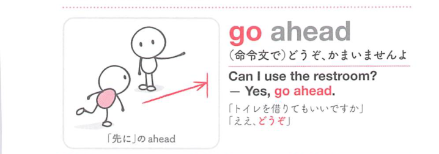
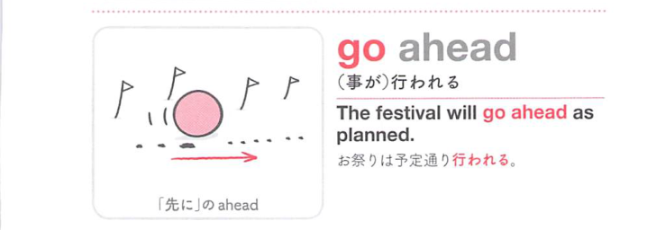
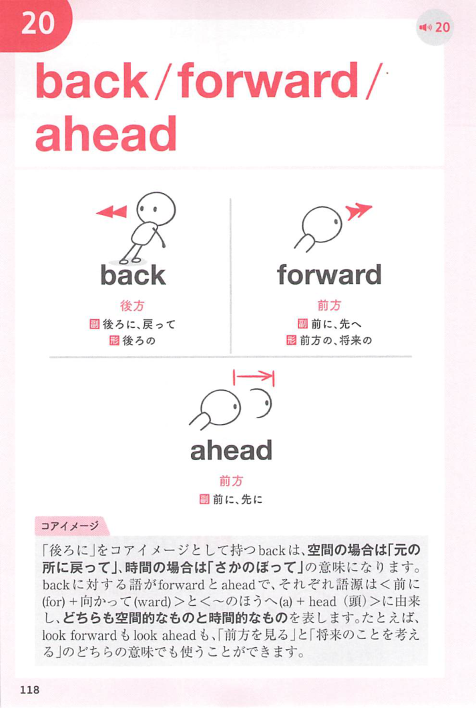
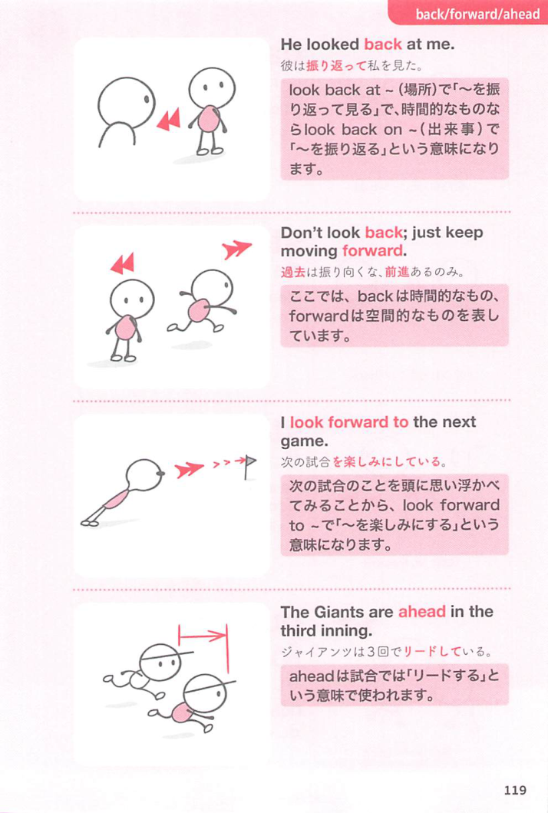

### 連想

go ahead は、go は「進む」なので、ある状態や方向へ移っていくイメージです。後ろの語句と合わせて、具体的な意味が決まります
このイメージから、`先に行く；(ためらわず)進む` という意味につながる。
補足として、go ahead with ~ は「〜を(どんどん)続ける[進める]」 という点も一緒に覚えておくとよい。

### 類義語
- go ahead
  - 対象の意味は「先に行く；(ためらわず)進む」。この熟語特有の語順・前置詞まで含めて覚える
- より直接的な基本表現
  - 日本語訳に近い意味を1語や短い表現で言い換える場合に使う。試験では熟語の形そのものを優先して覚える
- 文脈に応じた言い換え
  - 同じ日本語訳でも、対象・文体・前後関係によって自然な英語表現が変わる

### 画像
<!-- 熟語に対応する画像 -->

<!-- 動詞に対応する画像 -->

<!-- 前置詞に対応する画像 -->

