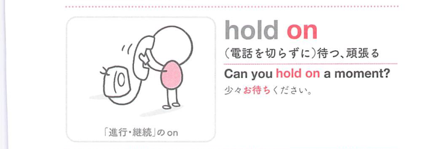

### 連想

hold on は、hold は「保つ・支える」なので、手元や一定状態にとどめるイメージです。特に on は「接触して続く、上に乗って進む、対象に向かう」方向を添えるので、熟語全体の意味につながります
このイメージから、`持ちこたえる、頑張る；待つ；電話を切らずにいる；しっかりつかむ` という意味につながる。
複数の意味がある場合も、中心になる構文・前置詞・場面を押さえると、文脈ごとの意味を選びやすい。
補足として、hold on to ~ で「(希望など)を持ち続ける」の意味にもなる。「〜をしっかりつかむ」は、hold on to ~。①②③は hang on と同義 という点も一緒に覚えておくとよい。

### 類義語
- hold on
  - 対象の意味は「持ちこたえる、頑張る；待つ；電話を切らずにいる；しっかりつかむ」。この熟語特有の語順・前置詞まで含めて覚える
- より直接的な基本表現
  - 日本語訳に近い意味を1語や短い表現で言い換える場合に使う。試験では熟語の形そのものを優先して覚える
- 文脈に応じた言い換え
  - 同じ日本語訳でも、対象・文体・前後関係によって自然な英語表現が変わる

### 画像
<!-- 熟語に対応する画像 -->

<!-- 動詞に対応する画像 -->

<!-- 前置詞に対応する画像 -->

