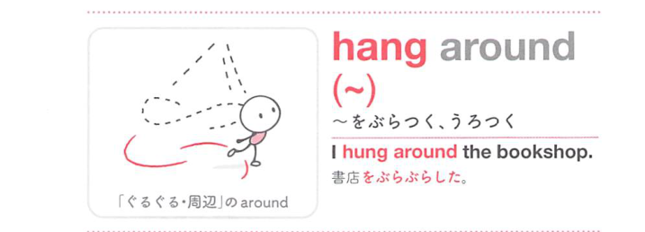
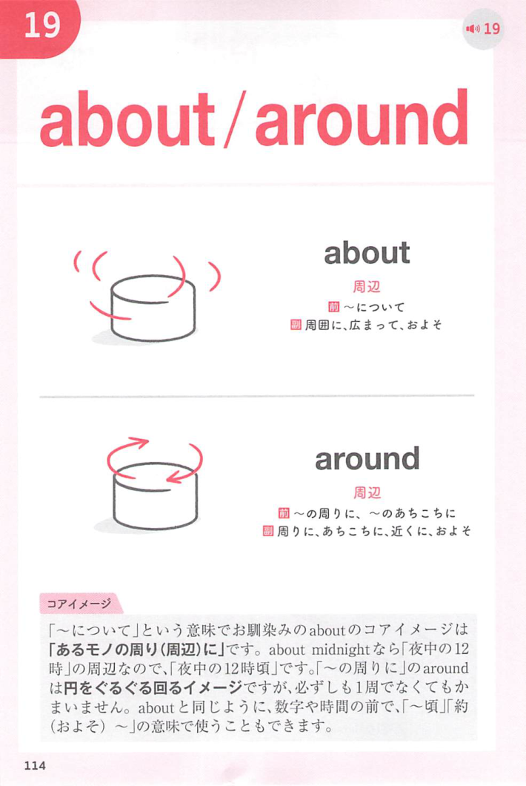
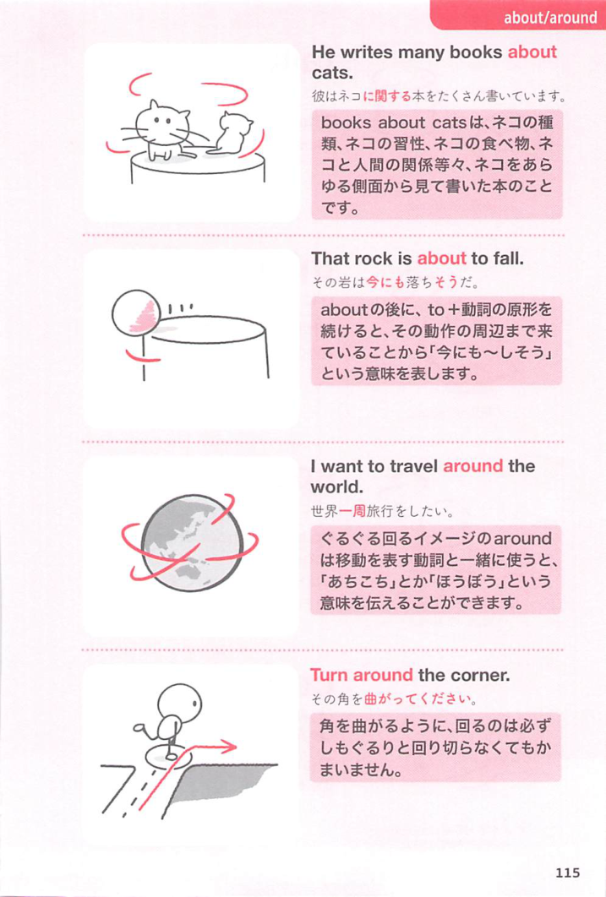

### 連想

hang around は、hang と around を別々に丸暗記するより、2語以上がまとまって1つの場面を作る表現として覚えると定着しやすいです
このイメージから、`ぶらつく；付き合う` という意味につながる。
補足として、「〜と付き合う[時間を過ごす]」は、hang around [about / round] with ~ という点も一緒に覚えておくとよい。

### 類義語
- hang around
  - 対象の意味は「ぶらつく；付き合う」。この熟語特有の語順・前置詞まで含めて覚える
- hang about
  - 同じ項目で扱われる別形。意味は近いが、使える形をまとめて覚える
- hang round
  - 同じ項目で扱われる別形。意味は近いが、使える形をまとめて覚える
- stick around about
  - 意味は近いが、後ろに続く語や文型が異なることがある

### 画像
<!-- 熟語に対応する画像 -->

<!-- 前置詞に対応する画像 -->

