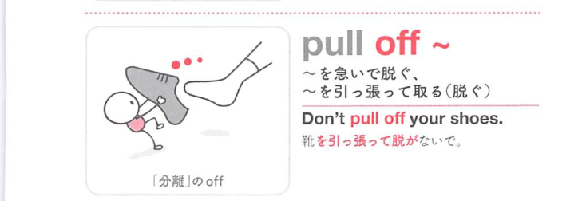
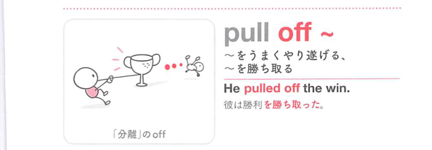
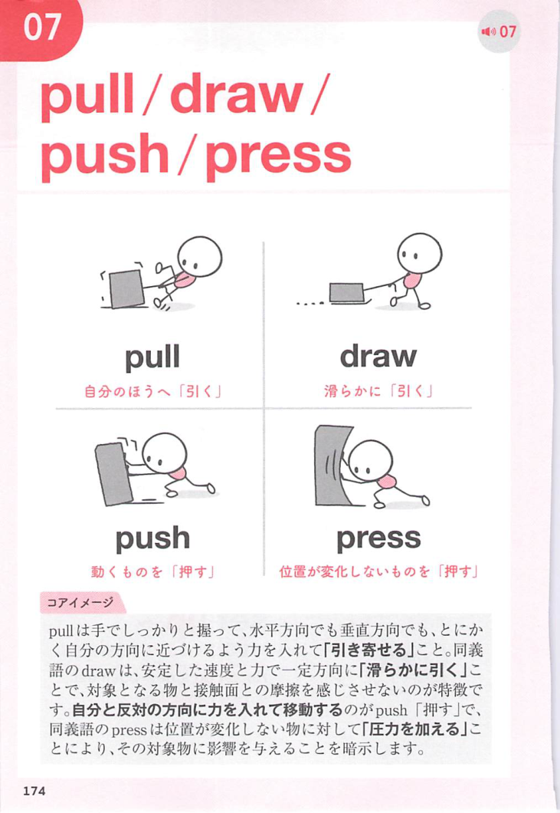
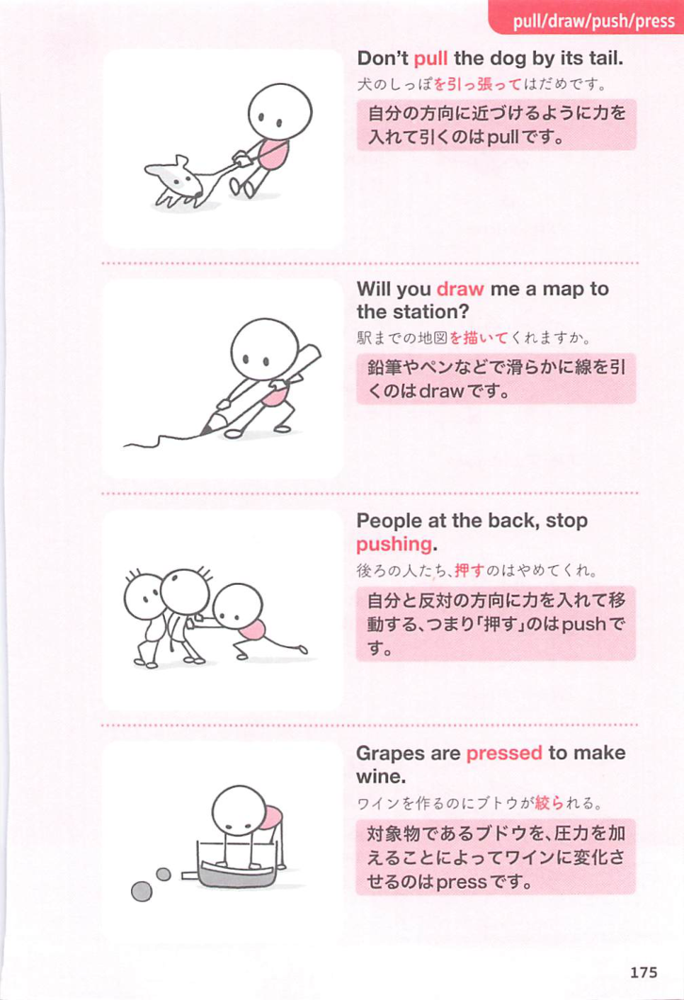

### 連想

pull off ~ は、off の「離れる、切り離す、停止する」という感覚を手がかりに、語句全体を1つの場面として捉えると覚えやすい表現です
このイメージから、`(口語で)(困難なこと)をやってのける` という意味につながる。
補足として、pull 〜 off も可。「急いで衣類を脱ぐ」の意味も という点も一緒に覚えておくとよい。

### 類義語
- pull off ~
  - 対象の意味は「(口語で)(困難なこと)をやってのける」。この熟語特有の語順・前置詞まで含めて覚える
- make it
  - 近い意味を表す表現。細かな文型や響きの違いに注意する

### 画像
<!-- 熟語に対応する画像 -->

<!-- 動詞に対応する画像 -->

<!-- 前置詞に対応する画像 -->

